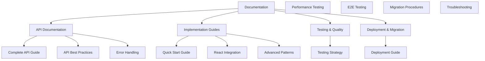

# Cin7 Pendo API Documentation

<div class="hero-section">
  <h1 class="hero-title">Cin7 Pendo API Integration</h1>
  <p class="hero-subtitle">Powerful analytics integration for comprehensive user insights and performance monitoring</p>

  <div class="hero-buttons">
    <a href="#quick-start" class="btn btn-primary">Get Started</a>
    <a href="https://github.com/your-org/cin7-pendo-api" class="btn btn-outline">View on GitHub</a>
  </div>
</div>

---

## 🚀 Quick Start

<div class="grid grid-cols-1 md:grid-cols-3 gap-6 my-8">
  <div class="card">
    <h3>📦 Installation</h3>
    <p>Clone the repository and install dependencies to get started immediately.</p>
    <pre><code>git clone https://github.com/your-org/cin7-pendo-api.git
cd cin7-pendo-api
npm install</code></pre>
  </div>

  <div class="card">
    <h3>⚙️ Configuration</h3>
    <p>Set up your environment variables with your Pendo API credentials.</p>
    <pre><code>cp .env.example .env.local
# Edit .env.local with your API key</code></pre>
  </div>

  <div class="card">
    <h3>🎯 Run Development</h3>
    <p>Start the development server to begin exploring the API integration.</p>
    <pre><code>npm run dev</code></pre>
  </div>
</div>

---

## 📚 Core Documentation

### 🎯 Getting Started

<div class="doc-section">
  <div class="doc-links">
    <div class="doc-link">
      <h4>📘 Complete API Guide</h4>
      <p>Comprehensive documentation covering all API methods, best practices, and implementation examples.</p>
      <a href="PENDO_API_COMPLETE_GUIDE.md" class="link-arrow">Read Complete Guide →</a>
    </div>

    <div class="doc-link">
      <h4>🧪 Testing Guide</h4>
      <p>Complete testing strategy including unit tests, integration tests, and end-to-end testing.</p>
      <a href="TESTING_GUIDE.md" class="link-arrow">Explore Testing →</a>
    </div>

    <div class="doc-link">
      <h4>🔄 Migration Guide</h4>
      <p>Step-by-step instructions for migrating between versions and platforms.</p>
      <a href="MIGRATION_GUIDES.md" class="link-arrow">View Migration Guide →</a>
    </div>
  </div>
</div>

### 🔧 API Reference

<div class="api-section">
  <h3>Core API Methods</h3>

  <div class="api-grid">
    <div class="api-method">
      <h4><span class="method get">GET</span> Page Information</h4>
      <p>Retrieve detailed information about specific pages including metadata and configuration.</p>
      <code><small>GET /api/v1/page/:id</small></code>
    </div>

    <div class="api-method">
      <h4><span class="method post">POST</span> Aggregation Queries</h4>
      <p>Execute complex analytics queries for time-series data and custom aggregations.</p>
      <code><small>POST /api/v1/aggregation</small></code>
    </div>

    <div class="api-method">
      <h4><span class="method get">GET</span> Analytics Data</h4>
      <p>Access pre-computed analytics including page views, visitor counts, and engagement metrics.</p>
      <code><small>GET /api/v1/analytics/:pageId</small></code>
    </div>
  </div>

  <div class="cta-section">
    <a href="PENDO_API_COMPLETE_GUIDE.md#api-reference" class="btn btn-secondary">View Full API Documentation</a>
  </div>
</div>

### 📊 Key Features

<div class="features-grid">
  <div class="feature">
    <h3>⚡ Performance Optimized</h3>
    <p>Built-in caching, rate limiting, and intelligent query optimization for fast response times.</p>
  </div>

  <div class="feature">
    <h3>🛡️ Type Safe</h3>
    <p>Full TypeScript support with comprehensive interfaces and error handling.</p>
  </div>

  <div class="feature">
    <h3>🎨 React Components</h3>
    <p>Pre-built UI components for data visualization and analytics dashboards.</p>
  </div>

  <div class="feature">
    <h3>🔄 Real-time Updates</h3>
    <p>Support for real-time data synchronization and live analytics updates.</p>
  </div>

  <div class="feature">
    <h3>📈 Comprehensive Analytics</h3>
    <p>Detailed metrics including time-series data, visitor analytics, and performance insights.</p>
  </div>

  <div class="feature">
    <h3>🔧 Easy Integration</h3>
    <p>Simple API design with clear documentation and examples for quick integration.</p>
  </div>
</div>

---

## 🛠️ Implementation Examples

### Basic Usage

```typescript
import { PendoAPIClient } from './src/lib/pendo-api';

// Initialize the client
const pendoClient = new PendoAPIClient(process.env.REACT_APP_PENDO_API_KEY);

// Fetch page information
const page = await pendoClient.getPage('your-page-id');
console.log(`Page: ${page.name}, Views: ${page.viewedCount}`);

// Get analytics data
const analytics = await pendoClient.getPageTotals('your-page-id', 30);
console.log(`Analytics:`, analytics);
```

### React Hook Integration

```typescript
import { usePendoPage } from './src/hooks/usePendoPage';

function PageAnalytics({ pageId }: { pageId: string }) {
  const { page, analytics, loading, error } = usePendoPage(pageId);

  if (loading) return <div>Loading analytics...</div>;
  if (error) return <div>Error: {error.message}</div>;

  return (
    <div>
      <h2>{page.name}</h2>
      <div className="metrics">
        <div className="metric">
          <h4>Total Views</h4>
          <p>{analytics.viewedCount.toLocaleString()}</p>
        </div>
        <div className="metric">
          <h4>Unique Visitors</h4>
          <p>{analytics.uniqueVisitors.toLocaleString()}</p>
        </div>
        <div className="metric">
          <h4>Avg. Time on Page</h4>
          <p>{Math.round(analytics.averageTimeOnPage / 60)}m</p>
        </div>
      </div>
    </div>
  );
}
```

---

## 📋 Documentation Structure

### 📁 Organization

Our documentation is organized into clear sections to help you find exactly what you need:



### 🎯 Quick Navigation

<div class="nav-grid">
  <div class="nav-item">
    <h4>📘 <strong>Core Documentation</strong></h4>
    <ul>
      <li><a href="README.md">Main Documentation</a></li>
      <li><a href="PENDO_API_COMPLETE_GUIDE.md">Complete API Guide</a></li>
      <li><a href="PENDO_API_BEST_PRACTICES.md">Best Practices</a></li>
    </ul>
  </div>

  <div class="nav-item">
    <h4>🔧 <strong>API Reference</strong></h4>
    <ul>
      <li><a href="api/PENDO_API_COMPLETE_GUIDE.md">Core API Methods</a></li>
      <li><a href="api/PENDO_API_ANALYSIS.md">API Analysis</a></li>
      <li><a href="api/PENDO_API_ERROR_HANDLING_GUIDE.md">Error Handling</a></li>
    </ul>
  </div>

  <div class="nav-item">
    <h4>🧪 <strong>Testing & Quality</strong></h4>
    <ul>
      <li><a href="TESTING_GUIDE.md">Testing Guide</a></li>
      <li><a href="../frontend/src/components/__tests__">Component Tests</a></li>
      <li><a href="../scripts">Testing Scripts</a></li>
    </ul>
  </div>

  <div class="nav-item">
    <h4>📊 <strong>Analysis & Research</strong></h4>
    <ul>
      <li><a href="IMPLEMENTATION_STATUS.md">Implementation Status</a></li>
      <li><a href="DATA_SOURCES.md">Data Sources</a></li>
      <li><a href="API_LIMITATIONS.md">API Limitations</a></li>
    </ul>
  </div>

  <div class="nav-item">
    <h4>🚀 <strong>Deployment & Migration</strong></h4>
    <ul>
      <li><a href="MIGRATION_GUIDES.md">Migration Guide</a></li>
      <li><a href="../NETLIFY_DEPLOYMENT_GUIDE.md">Netlify Deployment</a></li>
      <li><a href="../AI_DEVELOPMENT_INTEGRATION_GUIDE.md">AI Development</a></li>
    </ul>
  </div>

  <div class="nav-item">
    <h4>🎧 <strong>Pendo Listen Integration</strong></h4>
    <ul>
      <li><a href="../PENDO_LISTEN_INTEGRATION_PLAN.md">Integration Plan</a></li>
      <li><a href="../PENDO_LISTEN_QUICK_START.md">Quick Start</a></li>
      <li><a href="../PENDO_LISTEN_EXECUTIVE_SUMMARY.md">Executive Summary</a></li>
    </ul>
  </div>
</div>

---

## 🤝 Contributing

We welcome contributions to improve the Cin7 Pendo API project and its documentation!

### How to Contribute

1. **Fork the repository** on GitHub
2. **Create a feature branch** for your changes
3. **Make your changes** and add tests if applicable
4. **Update documentation** for any API changes
5. **Submit a pull request** with a clear description

### Documentation Contributions

- **Fix typos** or improve clarity
- **Add examples** and use cases
- **Update API documentation** for new features
- **Improve guides** and tutorials
- **Add diagrams** and visual aids

### Development Setup

```bash
# Clone the repository
git clone https://github.com/your-org/cin7-pendo-api.git
cd cin7-pendo-api

# Install dependencies
npm install

# Start development server
npm run dev

# Run tests
npm test

# Build documentation
npm run build:docs
```

---

## 🆘 Getting Help

### Support Channels

<div class="support-grid">
  <div class="support-item">
    <h4>📖 <strong>Documentation</strong></h4>
    <p>Start with our comprehensive documentation and guides.</p>
    <a href="README.md" class="link-text">Browse Documentation →</a>
  </div>

  <div class="support-item">
    <h4>🐛 <strong>GitHub Issues</strong></h4>
    <p>Report bugs or request features through GitHub issues.</p>
    <a href="https://github.com/your-org/cin7-pendo-api/issues" class="link-text">Report Issue →</a>
  </div>

  <div class="support-item">
    <h4>💬 <strong>Discussions</strong></h4>
    <p>Ask questions and share knowledge with the community.</p>
    <a href="https://github.com/your-org/cin7-pendo-api/discussions" class="link-text">Start Discussion →</a>
  </div>

  <div class="support-item">
    <h4>📧 <strong>Email Support</strong></h4>
    <p>Contact our development team for direct assistance.</p>
    <a href="mailto:support@yourorg.com" class="link-text">Email Support →</a>
  </div>
</div>

### Common Questions

<details>
  <summary>How do I get a Pendo API key?</summary>
  <p>You can obtain a Pendo API key from your Pendo account settings under Integrations > API Keys. Make sure to generate a key with appropriate permissions for your use case.</p>
</details>

<details>
  <summary>What are the API rate limits?</summary>
  <p>The standard API has a limit of 100 requests per minute, while the aggregation API is limited to 10 requests per minute. We recommend implementing caching and proper error handling to work within these limits.</p>
</details>

<details>
  <summary>How do I handle API timeouts?</summary>
  <p>Use the built-in retry logic with exponential backoff, and consider reducing your query scope. The aggregation API has a 5-minute timeout limit for complex queries.</p>
</details>

---

## 📈 Roadmap

### Current Status: Production Ready ✅

Our project is actively maintained and continuously improving. Here's what we're working on:

### Upcoming Features

- 🚀 **Enhanced Real-time Capabilities**: Live dashboard updates with WebSocket support
- 📊 **Advanced Analytics**: Custom report builder and data visualization tools
- 🌐 **Multi-app Support**: Support for multiple Pendo applications in a single instance
- 🔐 **Enhanced Security**: Advanced authentication and authorization features
- 📱 **Mobile App**: Native mobile applications for on-the-go analytics

### Technology Stack Updates

- ⚡ **Performance Improvements**: Continued optimization for faster load times
- 🎨 **UI/UX Enhancements**: Improved user interface based on user feedback
- 🔧 **Developer Tools**: Enhanced debugging and development utilities

---

## 📄 License

This project is licensed under the MIT License - see the [LICENSE](https://github.com/your-org/cin7-pendo-api/blob/main/LICENSE) file for details.

---

<div class="footer-section">
  <div class="footer-content">
    <div class="footer-links">
      <h4>Quick Links</h4>
      <ul>
        <li><a href="https://github.com/your-org/cin7-pendo-api">GitHub Repository</a></li>
        <li><a href="https://www.npmjs.com/package/cin7-pendo-api">NPM Package</a></li>
        <li><a href="https://pendo.io">Pendo Documentation</a></li>
      </ul>
    </div>

    <div class="footer-links">
      <h4>Resources</h4>
      <ul>
        <li><a href="PENDO_API_COMPLETE_GUIDE.md">API Documentation</a></li>
        <li><a href="TESTING_GUIDE.md">Testing Guide</a></li>
        <li><a href="MIGRATION_GUIDES.md">Migration Guide</a></li>
      </ul>
    </div>

    <div class="footer-links">
      <h4>Community</h4>
      <ul>
        <li><a href="https://github.com/your-org/cin7-pendo-api/discussions">Discussions</a></li>
        <li><a href="https://github.com/your-org/cin7-pendo-api/issues">Issues</a></li>
        <li><a href="https://github.com/your-org/cin7-pendo-api/pulls">Pull Requests</a></li>
      </ul>
    </div>
  </div>

  <div class="footer-bottom">
    <p>&copy; 2025 Cin7 Development Team. Built with ❤️ for better analytics integration.</p>
  </div>
</div>

<style>
.hero-section {
  text-align: center;
  padding: 3rem 0;
  background: linear-gradient(135deg, #667eea 0%, #764ba2 100%);
  color: white;
  margin: -2rem -2rem 2rem -2rem;
  border-radius: 0 0 1rem 1rem;
}

.hero-title {
  font-size: 3rem;
  font-weight: 700;
  margin-bottom: 1rem;
}

.hero-subtitle {
  font-size: 1.25rem;
  margin-bottom: 2rem;
  opacity: 0.9;
}

.hero-buttons {
  display: flex;
  gap: 1rem;
  justify-content: center;
  flex-wrap: wrap;
}

.btn {
  padding: 0.75rem 1.5rem;
  border-radius: 0.5rem;
  text-decoration: none;
  font-weight: 600;
  transition: all 0.2s;
  display: inline-block;
}

.btn-primary {
  background-color: white;
  color: #667eea;
}

.btn-primary:hover {
  background-color: #f8f9fa;
  transform: translateY(-2px);
}

.btn-outline {
  border: 2px solid white;
  color: white;
}

.btn-outline:hover {
  background-color: rgba(255, 255, 255, 0.1);
  transform: translateY(-2px);
}

.btn-secondary {
  background-color: #f1f5f9;
  color: #334155;
}

.btn-secondary:hover {
  background-color: #e2e8f0;
}

.card {
  background: white;
  padding: 1.5rem;
  border-radius: 0.5rem;
  box-shadow: 0 4px 6px rgba(0, 0, 0, 0.1);
  transition: transform 0.2s;
}

.card:hover {
  transform: translateY(-2px);
}

.doc-section {
  margin: 2rem 0;
}

.doc-links {
  display: grid;
  gap: 1.5rem;
}

.doc-link {
  background: #f8fafc;
  padding: 1.5rem;
  border-radius: 0.5rem;
  border-left: 4px solid #667eea;
}

.doc-link h4 {
  margin-bottom: 0.5rem;
  color: #1e293b;
}

.link-arrow {
  color: #667eea;
  text-decoration: none;
  font-weight: 600;
}

.link-arrow:hover {
  text-decoration: underline;
}

.api-section {
  background: #f1f5f9;
  padding: 2rem;
  border-radius: 0.5rem;
  margin: 2rem 0;
}

.api-grid {
  display: grid;
  gap: 1rem;
  margin: 1.5rem 0;
}

.api-method {
  background: white;
  padding: 1.5rem;
  border-radius: 0.5rem;
  border: 1px solid #e2e8f0;
}

.method {
  padding: 0.25rem 0.5rem;
  border-radius: 0.25rem;
  font-size: 0.875rem;
  font-weight: 600;
  color: white;
}

.get { background-color: #10b981; }
.post { background-color: #3b82f6; }
.put { background-color: #f59e0b; }
.delete { background-color: #ef4444; }

.features-grid {
  display: grid;
  grid-template-columns: repeat(auto-fit, minmax(250px, 1fr));
  gap: 1.5rem;
  margin: 2rem 0;
}

.feature {
  background: white;
  padding: 1.5rem;
  border-radius: 0.5rem;
  box-shadow: 0 2px 4px rgba(0, 0, 0, 0.1);
  border-top: 3px solid #667eea;
}

.nav-grid {
  display: grid;
  grid-template-columns: repeat(auto-fit, minmax(200px, 1fr));
  gap: 1.5rem;
  margin: 2rem 0;
}

.nav-item {
  background: #f8fafc;
  padding: 1rem;
  border-radius: 0.5rem;
}

.nav-item ul {
  list-style: none;
  padding: 0;
  margin: 0.5rem 0 0 0;
}

.nav-item li {
  margin: 0.25rem 0;
}

.nav-item a {
  color: #64748b;
  text-decoration: none;
  font-size: 0.875rem;
}

.nav-item a:hover {
  color: #667eea;
}

.support-grid {
  display: grid;
  grid-template-columns: repeat(auto-fit, minmax(250px, 1fr));
  gap: 1.5rem;
  margin: 2rem 0;
}

.support-item {
  background: white;
  padding: 1.5rem;
  border-radius: 0.5rem;
  box-shadow: 0 2px 4px rgba(0, 0, 0, 0.1);
}

.link-text {
  color: #667eea;
  text-decoration: none;
  font-weight: 600;
  font-size: 0.875rem;
}

.footer-section {
  background: #1e293b;
  color: white;
  padding: 3rem 0 1rem 0;
  margin: 3rem -2rem -2rem -2rem;
  border-radius: 1rem 1rem 0 0;
}

.footer-content {
  display: grid;
  grid-template-columns: repeat(auto-fit, minmax(200px, 1fr));
  gap: 2rem;
  margin-bottom: 2rem;
}

.footer-links h4 {
  margin-bottom: 1rem;
  color: #f1f5f9;
}

.footer-links ul {
  list-style: none;
  padding: 0;
  margin: 0;
}

.footer-links li {
  margin: 0.5rem 0;
}

.footer-links a {
  color: #94a3b8;
  text-decoration: none;
  font-size: 0.875rem;
}

.footer-links a:hover {
  color: #f1f5f9;
}

.footer-bottom {
  border-top: 1px solid #334155;
  padding-top: 1rem;
  text-align: center;
  color: #94a3b8;
  font-size: 0.875rem;
}

@media (max-width: 768px) {
  .hero-title {
    font-size: 2rem;
  }

  .hero-buttons {
    flex-direction: column;
    align-items: center;
  }

  .features-grid,
  .nav-grid,
  .support-grid {
    grid-template-columns: 1fr;
  }
}
</style>